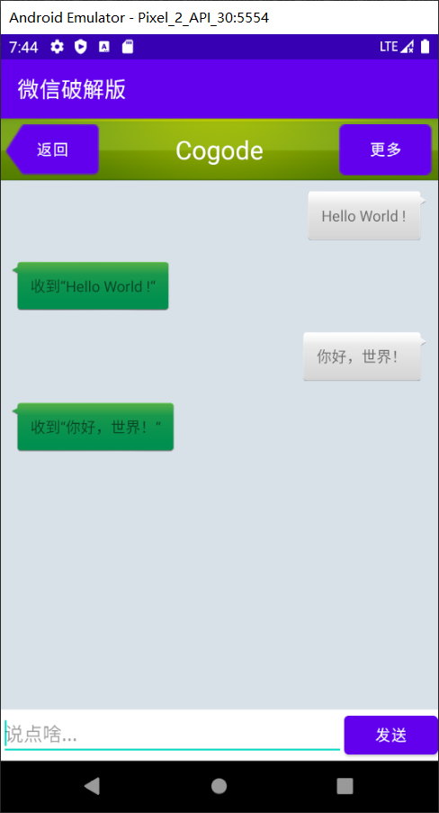

# Android_RecyclerView_Test
使用RecyclerView组件，编程实现一个简单的聊天程序。

ListView由于强大的功能，在过去的Android开发当中可以说是贡献卓越，直到今天仍然还有不计其数的程序在使用ListView。不过ListView并不是完美无缺的，比如如果不使用一些技巧来提升它的运行效率，那么ListView的性能就会非常差。还有，ListView的扩展性也不够好，它只能实现数据纵向滚动的效果，如果我们想实现横向滚动的话，ListView是做不到的。
    
为此，Android提供了一个更强大的滚动控件---RecyclerView。它可以说是一个增强版的ListView，不仅可以轻松实现和ListView同样的效果，还优化了ListView存在的各种不足之处。目前Android官方更加推荐使用RecyclerView，未来也会有更多的程序逐渐从ListView转向RecyclerView。

在虚拟机 Pixel_2_API_30 中的运行结果如图：

